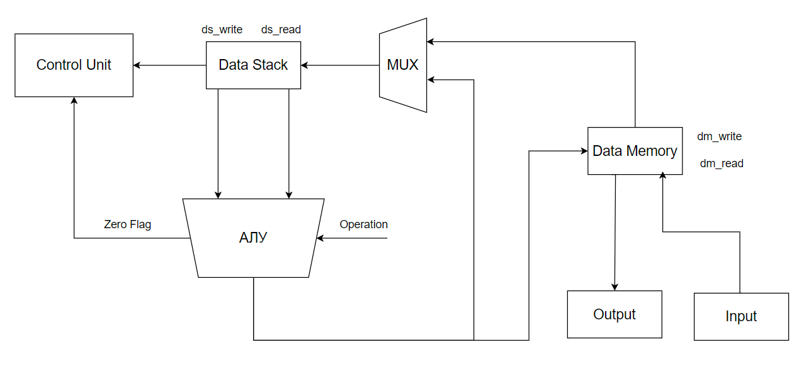

# Asm. Транслятор и модель

- Маликов Александр Максимович
- `asm | stack | harv | hw | instr | struct | trap -> stream | mem | pstr | prob1 | cache`
- Базовый вариант. Без усложнений.


## Язык программирования

``` ebnf
line            ::=   section | label comment? "\n"
                      | declaration comment? "\n"
                      | instr comment? "\n"
                      | comment "\n"

program         ::=     line*


section         ::=     "." section_name
section_name    ::=     "data" | "code"

declaration     ::=     variable_name type value
variable_name   ::=     <any of "a-z A-Z _"> { <any of "a-z A-Z 0-9 _"> }
type            ::=     NUMBER | STRING
value           ::=     number | string
number          ::=     { <any of "0-9"> }
string          ::=     "\"" { <any symbols except "\""> } "\""
                      | "\'" { <any symbols except "\'"> } "\'"

label           ::=     label_name ":"
label_name      ::=     <any of "a-z A-Z _"> { <any of "a-z A-Z 0-9 _"> }

instr           ::=     opcode0
                      | opcode1 operand | label_name 
              
opcode0         ::=     "POP" 
                      | "DUP" 
                      | "INC" 
                      | "DEC" 
                      | "SWAP" 
                      | "ADD" 
                      | "SUB" 
                      | "MUL" 
                      | "DIV" 
                      | "COMPARE" 
                      | "SAVE"
                      | "JNE" 
                      | "PRINT" 
                      | "PRINT_VAL" 
                      | "PRINT_BY_INDEX" 
                      | "NOP"
                      | "HLT"
                      
opcode1         ::=     "PUSH"
                      | "PUSH_VAL" 
                      | "LOAD"
                      | "JMP" 
                      | "JNE"
                      | "JEQ" 
                       

operand         ::=     value | variable_name

comment         ::=     ";" <any symbols except "\n">
```

Примечания:
- Код выполняется последовательно
- Область видимости - глобальная
- Первая указанная команда в сегменте инструкций считается началом программы
- Все переменные должны быть объявлены до использования в секции данных
- В программе не может быть меток, переменных и команд с одинаковыми именами
- Метки могут быть объявлены в любом месте программы, на отдельной строке
- Метка `interrupt` определяет исполняемый блок прерывания для чтения

Система команд:

- `PUSH value`          -- положить value на вершину стека
- `PUSH_VAL name`           -- положить адрес переменной на вершину стека
- `POP`                           -- сместить указатель вершины стека на одну ячейку влево
- `DUP`                     -- дублирование значения на вершине стека
- `INC`                 -- увеличить значение на вершине стека на 1
- `DEC`    -- уменьшить значение на вершине стека на 1
- `JMP`                          -- безусловный переход
- `JEQ`        -- условный переход, где сравнение `a == b` истинно 
- `JNE`  -- условный переход, где сравнение `a != b` истинно
- `SWAP`             -- поменять местами два верхних значения на вершине стека
- `ADD`             -- сложить два верхних значения на вершине стека
- `SUB`             -- вычесть из второго верхнего значения на стеке первое
- `MUL`             -- умножить два верхних значения на вершине стека
- `DIV`             -- разделить второе значение на вершине стека на первое
- `COMPARE`           -- сравнить два значения на вершине стека
- `LOAD addr`            -- по переданному адресу, загрузить на вершину стека значение из памяти
- `SAVE`            -- записать вершину стека в память по адресу (значению) второго значения в стеке
- `PRINT`             -- записать вершину стека как литерал на устройство вывода 
- `PRINT_VAL`            -- записать вершину стека в устройство вывода
- `PRINT_BY_INDEX`             -- записать значение из памяти в устройство вывода, по адресу (значению) вершины стека
- `NOP`             -- ничего не выполнять
- `HLT`     -- завершить выполнение программы
## Организация памяти

```
    data memory
+------------------+
| 00 :     in      |
| 01 :     out     |
| 02 :     ...     |
+------------------+

 instruction memory 
+------------------+
| 00 :     ...     |
|          ...     |
| n  :    struct   |
+------------------+

```
Пример инструкции в struct:
`{"index": 12, "opcode": "JMP", "arg": 1}`

Исходный код транслируется в файл, содержащий две секции:
 1) Данные
 2) Инструкции
- У программиста нет доступа к памяти инструкций
- Порты ввода-вывода отображаются в память. Для доступа к ним используются обращения к определенным заранее ячейкам в памяти данных
- Прямая адресация
- Все строки - массив символов, название переменной при трансляции заменяется на адрес, указывающий на число - количество символов в строке, где после хранится указанное число символов
## Транслятор

Интерфейс командной строки: `translator.py <input_file> <target_file>`

Реализовано в модуле: [translator](translator.py)

Этапы трансляции (функция `main`):

1. Удаление комментариев
2. Разделение секции данных и секции инструкций
3. Определение `labels` и их адресов
4. Конвертация инструкций в `struct` и подстановка адресов переменных
5. Объединение данных и команд

## Модель процессора
```
python machine.py <code_filepath> <stack_size> <input_filepath> <ticks_limit> <log_filepath>
```

### Data Path

Реализован в классе `DataPath`.



### Control Unit

Реализован в классе `ControlUnit`.


Описание:
- Процесс моделирования отслеживается по инструкциям (в Control Unit также идёт отсчёт в тактах для обработки прерываний)
- Выполнение последовательное
- Прекращение работы программы:
- - `HLT`
- - Деление на 0
- Прерывания фиксируются только между инструкциями

Флаги АЛУ:
- `zero` - устанавливается, если результат последней арифметической операции равен 0, или если истинно сравнение `a == b`
Набор инструкций:

|   Инструкция   | Количество тактов |
|:--------------:|:-----------------:|
|      PUSH      |         1         |
|    PUSH_VAL    |         2         |
|      DUP       |         2         |
|      POP       |         2         |
|      ADD       |         4         |
|      SUB       |         4         |
|      MUL       |         4         |
|      DIV       |      3 или 4      |
|      INC       |         3         |
|      DEC       |         3         |
|      JMP       |         1         |
|      JEQ       |      1 или 2      |
|      JNE       |      1 или 2      |
|     PRINT      |         2         |
|      SAVE      |         3         |
| PRINT_BY_INDEX |         3         |
|    COMPARE     |         4         |
|   PRINT_VAL    |         2         |
|      NOP       |         1         |
|      LOAD      |         2         |
|      SWAP      |         4         |
|      HLT       |         1         |

## Тестирование
Тестирование происходит при помощи Golden-тестов
Тесты реализованы в: [golden_test.py](golden_test.py). 

Конфигурации:
- [golden/cat.yml](golden/cat.yml)
- [golden/hello_world.yml](golden/hello_world.yml)
- [golden/hello_user.yml](golden/hello_user.yml)
- [golden/prob1.yml](golden/prob1.yml)

Запустить тесты: `poetry run pytest . -v`

Обновить конфигурацию golden tests:  `poetry run pytest . -v --update-goldens`

CI при помощи Github Action: [.github/workflows/asm.yml](.github/workflows/asm.yml)

Пример использования и журнал работы процессора на примере `hello_world`:
```text
in_source: |-
  .data:
    text STRING Hello World!!
  .code:
    PUSH_VAL text
    PUSH text
    loop:
      JMP print

    print:

      PRINT_BY_INDEX
      COMPARE
      JEQ end
      INC

      JNE loop
    end:
      HLT
in_stdin:

out_code: |-
  [{"index": 0, "opcode": "DATA_SIZE", "arg": 14},
   {"index": 1, "opcode": "DATA_SIZE", "arg": "13"},
   {"index": 2, "opcode": "DATA", "arg": 72},
   {"index": 3, "opcode": "DATA", "arg": 101},
   {"index": 4, "opcode": "DATA", "arg": 108},
   {"index": 5, "opcode": "DATA", "arg": 108},
   {"index": 6, "opcode": "DATA", "arg": 111},
   {"index": 7, "opcode": "DATA", "arg": 32},
   {"index": 8, "opcode": "DATA", "arg": 87},
   {"index": 9, "opcode": "DATA", "arg": 111},
   {"index": 10, "opcode": "DATA", "arg": 114},
   {"index": 11, "opcode": "DATA", "arg": 108},
   {"index": 12, "opcode": "DATA", "arg": 100},
   {"index": 13, "opcode": "DATA", "arg": 33},
   {"index": 14, "opcode": "DATA", "arg": 33},
   {"index": 15, "opcode": "PUSH_VAL", "arg": 1},
   {"index": 16, "opcode": "PUSH", "arg": 1},
   {"index": 17, "opcode": "NOP"},
   {"index": 18, "opcode": "JMP", "arg": 19},
   {"index": 19, "opcode": "NOP"},
   {"index": 20, "opcode": "PRINT_BY_INDEX"},
   {"index": 21, "opcode": "COMPARE"},
   {"index": 22, "opcode": "JEQ", "arg": 25},
   {"index": 23, "opcode": "INC"},
   {"index": 24, "opcode": "JNE", "arg": 17},
   {"index": 25, "opcode": "NOP"},
   {"index": 26, "opcode": "HLT"}]

out_stdout: |
  LoC: 18 , code instr. 12
  ============================================================
  Hello World!!

out_log: |-
  INFO      ::     SYSTEM      Starting execution
  DEBUG     ::     SYSTEM      Instructions memory: [{'index': 15, 'opcode': <Opcode.PUSH_VAL: 'PUSH_VAL'>, 'arg': 1}, {'index': 16, 'opcode': <Opcode.PUSH: 'PUSH'>, 'arg': 1}, {'index': 17, 'opcode': <Opcode.NOP: 'NOP'>}, {'index': 18, 'opcode': <Opcode.JMP: 'JMP'>, 'arg': 19}, {'index': 19, 'opcode': <Opcode.NOP: 'NOP'>}, {'index': 20, 'opcode': <Opcode.PRINT_BY_INDEX: 'PRINT_BY_INDEX'>}, {'index': 21, 'opcode': <Opcode.COMPARE: 'COMPARE'>}, {'index': 22, 'opcode': <Opcode.JEQ: 'JEQ'>, 'arg': 25}, {'index': 23, 'opcode': <Opcode.INC: 'INC'>}, {'index': 24, 'opcode': <Opcode.JNE: 'JNE'>, 'arg': 17}, {'index': 25, 'opcode': <Opcode.NOP: 'NOP'>}, {'index': 26, 'opcode': <Opcode.HLT: 'HLT'>}]
  DEBUG     ::     SYSTEM      Data memory: [0, 1, 13, 72, 101, 108, 108, 111, 32, 87, 111, 114, 108, 100, 33, 33]
  DEBUG     ::     SYSTEM      Data stack: []
  INFO      ::     INSTR       Processing PUSH_VAL 1
  DEBUG     ::     SYSTEM      Data stack: [13]
  INFO      ::     INSTR       Processing PUSH 1
  DEBUG     ::     SYSTEM      Data stack: [13, 1]
  INFO      ::     INSTR       Processing NOP
  DEBUG     ::     SYSTEM      Data stack: [13, 1]
  INFO      ::     INSTR       Processing JMP 19
  DEBUG     ::     SYSTEM      Data stack: [13, 1]
  INFO      ::     INSTR       Processing NOP
  DEBUG     ::     SYSTEM      Data stack: [13, 1]
  INFO      ::     INSTR       Processing PRINT_BY_INDEX
  DEBUG     ::     SYSTEM      Data stack: [13, 1]
  INFO      ::     INSTR       Processing COMPARE
  DEBUG     ::     SYSTEM      Data stack: [13, 1]
  INFO      ::     INSTR       Processing JEQ 25
  DEBUG     ::     SYSTEM      Data stack: [13, 1]
  INFO      ::     INSTR       Processing INC
  DEBUG     ::     ALU         Incrementing 1
  DEBUG     ::     SYSTEM      Data stack: [13, 2]
  INFO      ::     INSTR       Processing JNE 17
  DEBUG     ::     SYSTEM      Data stack: [13, 2]
  INFO      ::     INSTR       Processing JMP 19
  DEBUG     ::     SYSTEM      Data stack: [13, 2]
  INFO      ::     INSTR       Processing NOP
  DEBUG     ::     SYSTEM      Data stack: [13, 2]
  INFO      ::     INSTR       Processing PRINT_BY_INDEX
  DEBUG     ::     SYSTEM      Data stack: [13, 2]
  INFO      ::     INSTR       Processing COMPARE
  DEBUG     ::     SYSTEM      Data stack: [13, 2]
  INFO      ::     INSTR       Processing JEQ 25
  DEBUG     ::     SYSTEM      Data stack: [13, 2]
  INFO      ::     INSTR       Processing INC
  DEBUG     ::     ALU         Incrementing 2
  DEBUG     ::     SYSTEM      Data stack: [13, 3]
  INFO      ::     INSTR       Processing JNE 17
  DEBUG     ::     SYSTEM      Data stack: [13, 3]
  INFO      ::     INSTR       Processing JMP 19
  DEBUG     ::     SYSTEM      Data stack: [13, 3]
  INFO      ::     INSTR       Processing NOP
  DEBUG     ::     SYSTEM      Data stack: [13, 3]
  INFO      ::     INSTR       Processing PRINT_BY_INDEX
  DEBUG     ::     SYSTEM      Data stack: [13, 3]
  INFO      ::     INSTR       Processing COMPARE
  DEBUG     ::     SYSTEM      Data stack: [13, 3]
  INFO      ::     INSTR       Processing JEQ 25
  DEBUG     ::     SYSTEM      Data stack: [13, 3]
  INFO      ::     INSTR       Processing INC
  DEBUG     ::     ALU         Incrementing 3
  DEBUG     ::     SYSTEM      Data stack: [13, 4]
  INFO      ::     INSTR       Processing JNE 17
  DEBUG     ::     SYSTEM      Data stack: [13, 4]
  INFO      ::     INSTR       Processing JMP 19
  DEBUG     ::     SYSTEM      Data stack: [13, 4]
  INFO      ::     INSTR       Processing NOP
  DEBUG     ::     SYSTEM      Data stack: [13, 4]
  INFO      ::     INSTR       Processing PRINT_BY_INDEX
  DEBUG     ::     SYSTEM      Data stack: [13, 4]
  INFO      ::     INSTR       Processing COMPARE
  DEBUG     ::     SYSTEM      Data stack: [13, 4]
  INFO      ::     INSTR       Processing JEQ 25
  DEBUG     ::     SYSTEM      Data stack: [13, 4]
  INFO      ::     INSTR       Processing INC
  DEBUG     ::     ALU         Incrementing 4
  DEBUG     ::     SYSTEM      Data stack: [13, 5]
  INFO      ::     INSTR       Processing JNE 17
  DEBUG     ::     SYSTEM      Data stack: [13, 5]
  INFO      ::     INSTR       Processing JMP 19
  DEBUG     ::     SYSTEM      Data stack: [13, 5]
  INFO      ::     INSTR       Processing NOP

 ........
  Сокращено из-за большого размера 
 ........
  INFO      ::     INSTR       Processing HLT
  DEBUG     ::     INTER       Have 1 interruptions
  DEBUG     ::     INTER       Processing Interruption: HLT
  INFO      ::     SYSTEM      Halting
  INFO      ::     SYSTEM      Program finished: ticks = 318, instructions executed = 94
```

Пример тестирования:
```text
============================= test session starts =============================
collecting ... collected 4 items

golden_test.py::test_translator_and_machine[golden/cat.yml] 
golden_test.py::test_translator_and_machine[golden/hello_user.yml] 
golden_test.py::test_translator_and_machine[golden/hello_world.yml] 
golden_test.py::test_translator_and_machine[golden/prob1.yml] 

============================== 4 passed in 3.48s ==============================
PASSED       [ 25%]PASSED [ 50%]PASSED [ 75%]PASSED     [100%]
```

```text
| ФИО                          | алг        | LoC  | code байт | code инстр. | инстр.    | такт.    | вариант |
| Маликов Александр Максимович | hello      | 18   | -         | 12          | 94        | 318      | -       |
| Маликов Александр Максимович | cat        | 19   | -         | 14          | 143       | 427      | -       |
| Маликов Александр Максимович | hello_user | 110  | -         | 77          | 450       | 1461     | -       |
| Маликов Александр Максимович | prob1      | 97   | -         | 82          | 6617      | 24632    | -       |
```